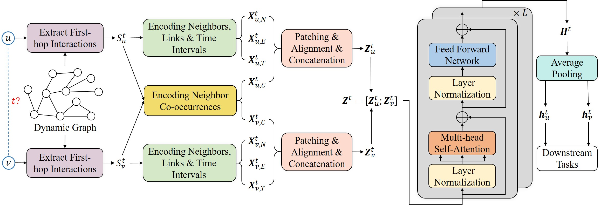

# DyGFormer-Extended: Dynamic Graph Learning with ATS, GHA, and WTNS

> **A dynamic graph learning architecture extending DyGFormer with Adaptive Temporal Smoothing (ATS), Graph-Based Hierarchical Attention (GHA), and Weighted Temporal Neighbor Similarity (WTNS) to better capture temporal, structural, and relational dynamics.**

---

## Overview

Dynamic Graph Library (DyGLib) is an open-source toolkit with standard training pipelines, extensible coding interfaces, and comprehensive evaluating strategies, 
which aims to promote standard, scalable, and reproducible dynamic graph learning research. Diverse benchmark datasets and thorough baselines are involved in DyGLib.


**DyGFormer-Extended** improves upon DyGFormer by introducing:
✅ Adaptive Temporal Smoothing (ATS)  
✅ Graph-Based Hierarchical Attention (GHA)  
✅ Weighted Temporal Neighbor Similarity (WTNS)

These enhancements improve:
- Temporal decay handling
- Structural awareness via node centrality
- Neighbor interaction modeling
- Performance on dynamic link prediction & node classification

## 🎯 Motivation

While DyGFormer excels in long-term dependencies, it struggles when:
❌ Interactions are short-lived  
❌ Temporal importance varies  
❌ Structural hierarchy (node influence) matters  
❌ Co-occurrence between neighbors is oversimplified

**Goal:** Build a model that adapts to diverse temporal patterns, leverages structural hierarchies, and better captures meaningful neighbor interactions.

---

## 🧠 Key Contributions

✅ **Adaptive Temporal Smoothing (ATS)**  
Learns a temporal decay parameter to weight recent/older interactions dynamically.

✅ **Graph-Based Hierarchical Attention (GHA)**  
Introduces node centrality directly into attention scores for structural importance.

✅ **Weighted Temporal Neighbor Similarity (WTNS)**  
Enhances co-occurrence encoding using temporal weights + centrality.

✅ **Improved performance** on short, long, and mixed temporal datasets.

✅ **Scalable & efficient** – suitable for large dynamic graphs.

---

## 📂 Datasets Used

| Dataset   | Nodes | Edges | Dynamics         | Notes |
|-----------|------:|------:|------------------|------|
| MOOC      | 7,047 | 411K  | Short-lived       | Student ↔ content interactions |
| Wikipedia | 9,227 | 157K  | Long-term         | User edits with features |
| Social Evo| 74    | 2M    | Mixed             | Physical proximity events |
| Dgraph    | 3.7M  | 4.3M  | Short-lived       | Large-scale social network |

---

## 🔄 Data Preprocessing Pipeline

1️⃣ Load raw interaction data  
2️⃣ Extract (source, destination, timestamp, label, features)  
3️⃣ Re-index nodes (start from 1)  
4️⃣ Generate edge features (.npy)  
5️⃣ Initialize node features (.npy)  
6️⃣ Validate integrity (edges match features)  

We can run ```preprocess_data/preprocess_data.py``` for pre-processing the datasets.
For example, to preprocess the *Wikipedia* dataset, we can run the following commands:
```{bash}
cd preprocess_data/
python preprocess_data.py  --dataset_name wikipedia
```
We can also run the following commands to preprocess all the original datasets at once:
```{bash}
cd preprocess_data/
python preprocess_all_data.py
```
---

## 🏗 Proposed Architecture

### ✅ 1. Adaptive Temporal Smoothing (ATS)
Learns how past interactions decay over time:
\[
w_{ij} = \exp(-\lambda (t - t_j))
\]

### ✅ 2. Graph-Based Hierarchical Attention (GHA)
Incorporates node centrality into attention:
\[
\alpha_{uv} = \text{Softmax}\left( \frac{(q_u + c_u)(k_v + c_v)^\top}{\sqrt{d_k}} \right)
\]

### ✅ 3. Weighted Temporal Neighbor Similarity (WTNS)
Improves co-occurrence encoding:
\[
WTNS(u, v, w) = \frac{w_{uw} \cdot c_w \cdot w_{vw}}{\sqrt{(w_{uw}^2 + c_w^2)(w_{vw}^2 + c_w^2)}}
\]

-----

## Dynamic Graph Learning Models

Eight popular continuous-time dynamic graph learning methods are included in DyGLib, including 
[JODIE](https://dl.acm.org/doi/10.1145/3292500.3330895), 
[DyRep](https://openreview.net/forum?id=HyePrhR5KX), 
[TGAT](https://openreview.net/forum?id=rJeW1yHYwH), 
[TGN](https://arxiv.org/abs/2006.10637), 
[CAWN](https://openreview.net/forum?id=KYPz4YsCPj), 
[EdgeBank](https://openreview.net/forum?id=1GVpwr2Tfdg), 
[TCL](https://arxiv.org/abs/2105.07944), and 
[GraphMixer](https://openreview.net/forum?id=ayPPc0SyLv1).
Our recent work [DyGFormer](https://arxiv.org/abs/2303.13047) is also integrated into DyGLib, which can explore the correlations of the source node and destination node by a neighbor co-occurrence encoding scheme, and
effectively and efficiently benefit from longer histories via a patching technique.



## Evaluation Tasks

DyGLib supports dynamic link prediction under both transductive and inductive settings with three (i.e., random, historical, and inductive) negative sampling strategies,
as well as dynamic node classification.


## Incorporate New Datasets or New Models

New datasets and new models are welcomed to be incorporated into DyGLib by pull requests.
* For new datasets: The format of new datasets should satisfy the requirements in ```DG_data/DATASETS_README.md```. 
  Users can put the new datasets in ```DG_data``` folder, and then run ```preprocess_data/preprocess_data.py``` to get the processed datasets.
* For new models: Users can put the model implementation in  ```models``` folder, 
  and then create the model in ```train_xxx.py``` or ```evaluate_xxx.py``` to run the model.


## Environments

[PyTorch 1.8.1](https://pytorch.org/),
[numpy](https://github.com/numpy/numpy),
[pandas](https://github.com/pandas-dev/pandas),
[tqdm](https://github.com/tqdm/tqdm), and 
[tabulate](https://github.com/astanin/python-tabulate)


## Executing Scripts

### Scripts for Dynamic Link Prediction
Dynamic link prediction could be performed on all the thirteen datasets. 
If you want to load the best model configurations determined by the grid search, please set the *load_best_configs* argument to True.
#### Model Training
* Example of training *DyGFormer* on *Wikipedia* dataset:
```{bash}
python train_link_prediction.py --dataset_name wikipedia --model_name DyGFormer --patch_size 2 --max_input_sequence_length 64 --num_runs 5 --gpu 0
```
* If you want to use the best model configurations to train *DyGFormer* on *Wikipedia* dataset, run
```{bash}
python train_link_prediction.py --dataset_name wikipedia --model_name DyGFormer --load_best_configs --num_runs 5 --gpu 0
```
#### Model Evaluation
Three (i.e., random, historical, and inductive) negative sampling strategies can be used for model evaluation.
* Example of evaluating *DyGFormer* with *random* negative sampling strategy on *Wikipedia* dataset:
```{bash}
python evaluate_link_prediction.py --dataset_name wikipedia --model_name DyGFormer --patch_size 2 --max_input_sequence_length 64 --negative_sample_strategy random --num_runs 5 --gpu 0
```
* If you want to use the best model configurations to evaluate *DyGFormer* with *random* negative sampling strategy on *Wikipedia* dataset, run
```{bash}
python evaluate_link_prediction.py --dataset_name wikipedia --model_name DyGFormer --negative_sample_strategy random --load_best_configs --num_runs 5 --gpu 0
```

### Scripts for Dynamic Node Classification
Dynamic node classification could be performed on Wikipedia and Reddit (the only two datasets with dynamic labels).
#### Model Training
* Example of training *DyGFormer* on *Wikipedia* dataset:
```{bash}
python train_node_classification.py --dataset_name wikipedia --model_name DyGFormer --patch_size 2 --max_input_sequence_length 64 --num_runs 5 --gpu 0
```
* If you want to use the best model configurations to train *DyGFormer* on *Wikipedia* dataset, run
```{bash}
python train_node_classification.py --dataset_name wikipedia --model_name DyGFormer --load_best_configs --num_runs 5 --gpu 0
```
#### Model Evaluation
* Example of evaluating *DyGFormer* on *Wikipedia* dataset:
```{bash}
python evaluate_node_classification.py --dataset_name wikipedia --model_name DyGFormer --patch_size 2 --max_input_sequence_length 64 --num_runs 5 --gpu 0
```
* If you want to use the best model configurations to evaluate *DyGFormer* on *Wikipedia* dataset, run
```{bash}
python evaluate_node_classification.py --dataset_name wikipedia --model_name DyGFormer --load_best_configs --num_runs 5 --gpu 0
```

